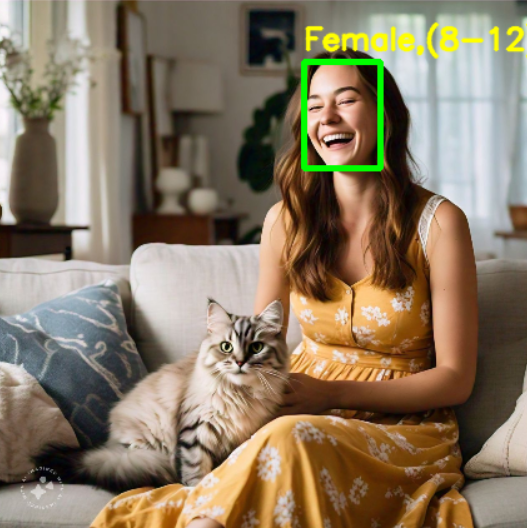

# Face Detection and Gender-Age Prediction using OpenCV

This repository contains two Python projects for face detection: one using the lightweight Haar Cascade model and another leveraging the power of OpenCV's pre-trained deep learning model, which additionally provides gender and age detection.

## Features

Both the projects Can process Faces on Images, Videos and can access Your device Camera.

- **Haar Cascade Model**:
  - Lightweight and easy to implement.
  - Real-time face detection with minimal computational resources.
  - Ideal for simple applications and devices with limited processing power.

- **OpenCV Pre-trained Model**:
  - Advanced face detection with higher accuracy.
  - Predicts gender and age from detected faces.

Still as the dataset used in making these models is very low compared to the data used in modern deep learning models so they are not robusts.
## Getting Started

### Prerequisites

- Python 3.x
- OpenCV (`cv2`)
- Numpy

Install the required packages using pip:

```bash
pip install opencv-python numpy
```
### Running the Projects

#### 1. Haar Cascade Model

Navigate to the ```face_detect_HaarCascade``` directory and run the script:

```bash
python face_detect.py
```

#### 2. OpenCV Model

Navigate to the ```face_detect_opencvPreTrainedModel``` directory and run the script:

```bash
python main.py
```

## Screenshots

### Haar Cascade Model


### OpenCV Pre-trained Model



## Contact

Feel free to reach out for any queries or collaboration opportunities:

- **LinkedIn**: [Harsh Awasthi](https://www.linkedin.com/in/harsh-awasthi-746b64277/)
  
